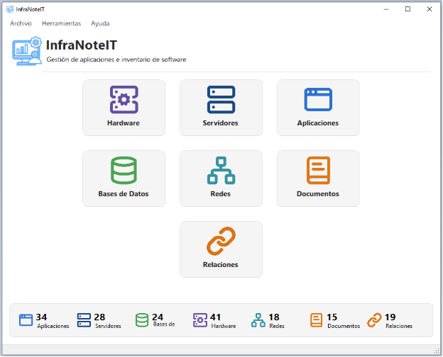
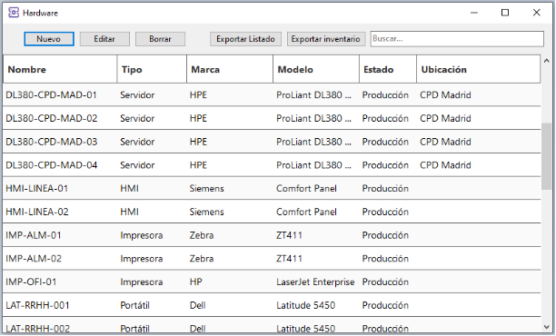
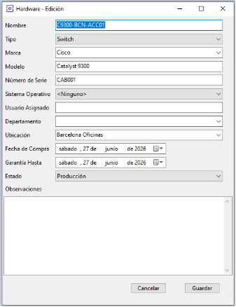
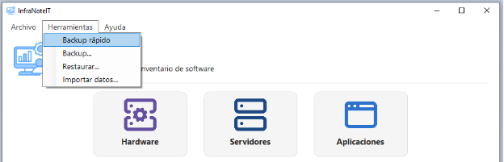
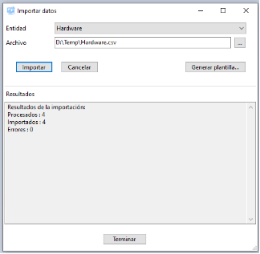
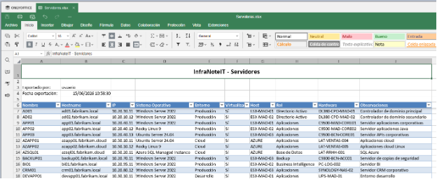

# InfraNoteIT

> Professional IT infrastructure inventory and documentation for
> Windows.

InfraNoteIT is a Windows desktop application designed to centralize the
inventory and technical documentation of IT infrastructures.

It allows you to register and manage hardware, servers, applications,
databases, networks, documents and relationships from a single,
intuitive interface.

------------------------------------------------------------------------

## Features

-   Hardware inventory
-   Server management
-   Application inventory
-   Database management
-   Network inventory
-   Document management
-   Relationships between infrastructure elements
-   Dashboard with infrastructure statistics
-   CSV import
-   Microsoft Excel export
-   Integrated backup and restore
-   SQLite database (no database server required)

## Included

-   Windows installer (64-bit)
-   Empty database
-   Demo database
-   User manual (PDF)
-   Sample documentation
-   License agreement

## Screenshots

## System Requirements

-   Windows 10 or Windows 11 (64-bit)
-   Approximately 100 MB of free disk space

## Documentation

The complete User Manual is included with the installer.

## Download

[Available on Gumroad.](https://fernandz0227.gumroad.com/l/wwbwox)

## Roadmap

### Version 1.1

-   User interface improvements
-   English localization
-   Internal refactoring
-   Performance optimizations

## Support

jfernandez.sfm@gmail.com

## License

InfraNoteIT is commercial software. See the included LICENSE file.

© 2026 InfraNoteIT. All rights reserved.
